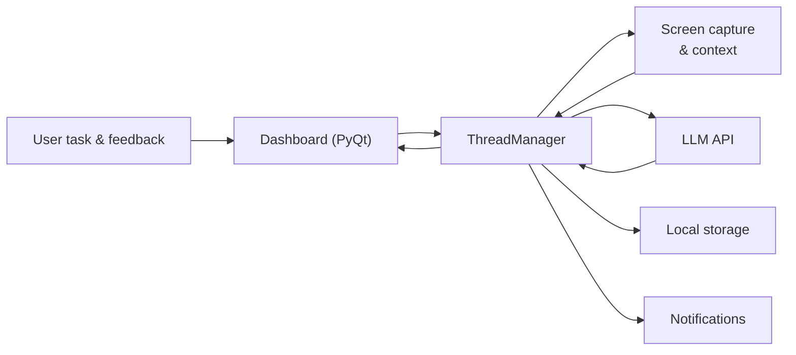

# INA (Intent Assistant)

Working on digital devices, people often face distractions that can lead to a decline in productivity. INA is an intelligent assistant designed to address this challenge. It elicits a user’s intention, clarifies it, and then leverages a Large Language Model (LLM) to continuously analyze on-screen activity. When deviations from the stated goal occur, it provides gentle nudges. Unlike simple rule-based blockers, INA is designed to be a collaborative assistant that understands user context, supporting users in aligning their digital behavior with their intentions.

---

## 🚀 Quick Start (For Users)
Get going immediately—no developer setup required.

- ⬇️ **Download the latest macOS build:** [`INA-v1.0.0.dmg`](https://github.com/IntentAssistant/INA/releases/latest/download/INA-v1.0.0.dmg)
- 🖥️ **Platform:** macOS 10.15 Catalina or later
- 📘 **App Usage Guide:** [Google Docs](https://docs.google.com/document/d/1pVUKl5Z7BO9yZe7-pChIgcgEu0JM3DWsI0gXtaqBdew/edit?usp=sharing)

---

## ✨ Key Features
- **Real-time activity analysis** – periodically inspects the screen with an LLM to check if you’re still on-task.
- **Major LLM integration** – works with OpenAI (GPT) or Google (Gemini) via API keys you supply.
- **Feedback-driven learning** – “correct / incorrect” feedback tunes future judgments to your personal definition of on-task.
- **100% local data** – screenshots stay in memory; logs and configs live under `~/INA_Data` and `~/.intention_app`.

---

## 🔬 Research Background
INA is part of an ongoing research effort on aligned intention monitoring.  
The repository accompanies our forthcoming paper and project site.

- 📄 ArXiv preprint: _(link coming soon)_  
- 🌐 Project page: [link](intentassistant.github.io)

---

## 🛠️ Getting Started (For Developers)

### Prerequisites
- macOS 10.15 (Catalina) or later  
- Python 3.9+ (3.11 recommended)  
<!-- - Xcode Command Line Tools: `xcode-select --install` -->

### Development Setup
```bash
python3 -m venv .venv
source .venv/bin/activate
pip install --upgrade pip
pip install -r requirements.txt
```

### Running the App
```bash
python main.py
```
On first launch macOS will prompt for **Screen Recording**, **Accessibility**, and **Notifications** permissions.  
Grant them in System Settings so INA can observe the screen and trigger nudges.

Helper script (prefers the system Python and warns about conda environments):
```bash
./run_app.sh
```

---

## 🔑 Configuring LLM API Keys
INA calls LLM APIs directly using the key you provide.

1. Launch INA and open **Settings → Models**.  
2. Select **OpenAI GPT** or **Google Gemini**.  
3. Paste your API key and choose a model.  
4. Click **Test API Key** to verify connectivity, then **Save**.  

Configuration is stored locally at `~/.intention_app/api_config.json` (encrypted on disk).

### Estimated Token Costs
Assuming 1 inference / 2 seconds (~1,800 per hour) with ~26,500 input tokens and ~40 output tokens each:

| Model | Price per hour (USD) |
| --- | ---:|
| GPT-4o mini | 7.20 |
| GPT-5 | 60.00 |
| GPT-5 mini | 12.00 |
| GPT-4.1 | 96.00 |
| Gemini 2.5 Pro | 60.00 |
| Gemini 2.5 Flash | 14.50 |
| Gemini 2.5 Flash-Lite *(recommended)* | 4.80 |
| Gemini 2.0 Flash | 4.80 |
| Gemini 2.0 Flash-Lite | 3.60 |

---

## 🔧 Technical Details

<details>
<summary><strong>📂 Repository Layout</strong></summary>

| Path | Purpose |
| --- | --- |
| `src/app.py` | Orchestrates the PyQt dashboard, notifications, capture loop, and LLM scheduling. |
| `src/ui/` | Widgets, dialogs, dashboard logic, and the feedback/reflection managers. |
| `src/config/` | Constants, prompt builders, and the API configuration manager. |
| `src/utils/` | Screen/app detectors, direct LLM clients, login helpers, etc. |
| `src/logging/` | Local storage helpers for `_llm_results.json`, `_feedbacks.json`, `_reflections.json`, etc. |
| `setup.py` | py2app configuration for packaging into a standalone `.app`. |
| `build_dmg.sh`, `create_dmg_background.py` | Utilities for creating a DMG release. |
| `architecture.md` | Detailed diagrams for capture and feedback flows. |

</details>

<details>
<summary><strong>📦 Building a macOS App Bundle</strong></summary>

Create the standalone bundle via py2app:
```bash
python setup.py py2app
```
Artifacts appear under `dist/INA.app`.  

To generate a distributable DMG (with custom background):
```bash
./build_dmg.sh
```
> py2app does not automatically bundle `libffi`. If the script cannot locate `libffi.8.dylib`, set `LIBFFI_PATH` manually (e.g. `export LIBFFI_PATH=/Library/Frameworks/Python.framework/Versions/3.11/lib/libffi.8.dylib`) before building.

> py2app copies whatever exists in the active virtual environment. Run builds from the same venv you used for `pip install -r requirements.txt`.

</details>

<details>
<summary><strong>📊 Data & Logging</strong></summary>

- Session logs (`_llm_results.json`, `_feedbacks.json`, `_reflections.json`) live in `~/INA_Data/session_data/<task_session>/`.  
- Console output is tee’d into `~/INA_Data/logs/`.  
- API settings and UI preferences are stored in `~/.intention_app/api_config.json`.  
- Screenshots are never written to disk; they exist in RAM only long enough to be encoded for the LLM API call.  
- Downstream data handling respects each provider’s API policy (OpenAI, Google).

</details>

<details>
<summary><strong>🧱 Architecture</strong></summary>

High-level flow:



For full diagrams (capture pipeline, feedback/reflection) see [`architecture.md`](architecture.md).

</details>

---

## 🤝 Contributing
- Bug reports and feature suggestions are welcome through GitHub Issues.  
- Before opening a Pull Request, please start a discussion describing the change.  
- Keep contributions ASCII when possible and document complex logic with concise comments.

---

## 📜 License
This project is released under the [MIT License](LICENSE).
