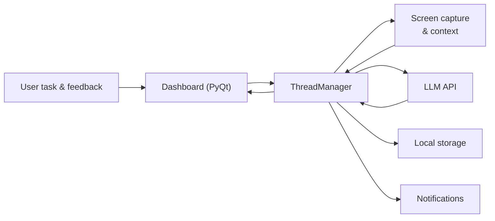
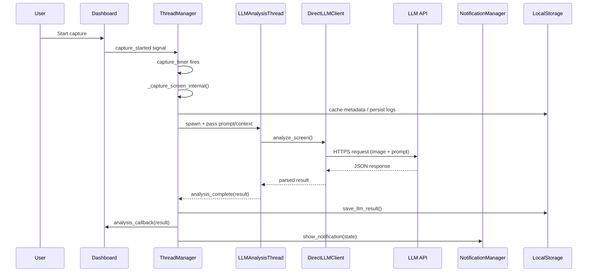
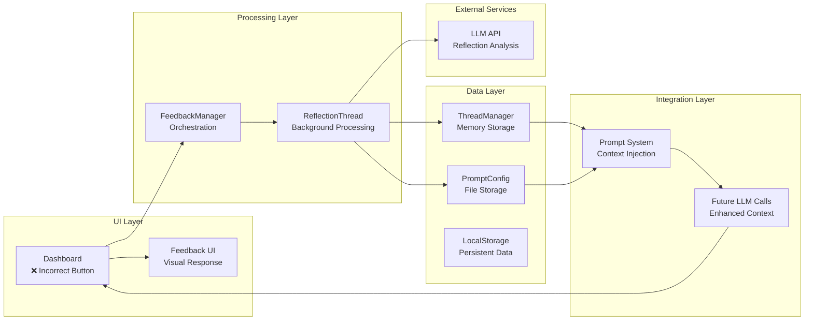
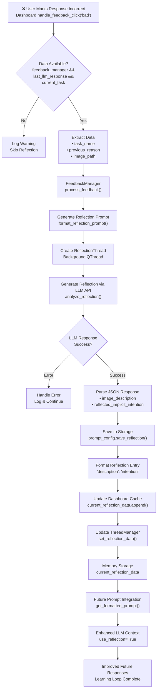
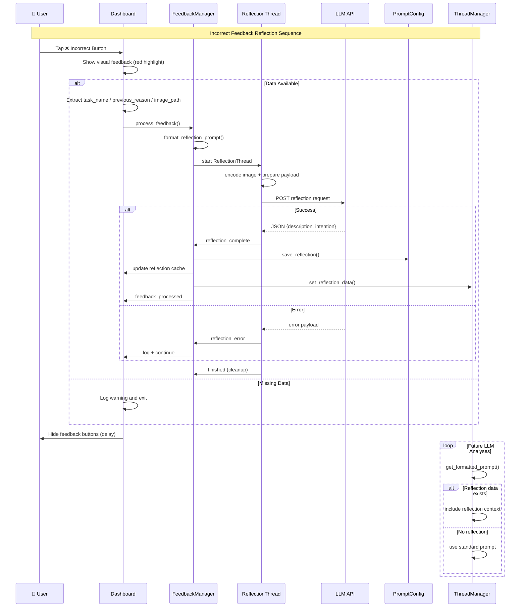

# INA App – Architecture

## System Overview
- **INA App** (`src/app.py`) embeds a hidden `rumps.App`, boots a `QApplication`, and wires core services (storage, prompts, notifications, dashboard, thread manager).
- **ThreadManager** (`src/manager.py`) schedules capture/analysis timers, manages capture metadata, orchestrates `LLMAnalysisThread`s, and feeds results back into storage, dashboard, and notifications.
- **Dashboard** (`src/ui/dashboard.py`) is the primary PyQt UI for setting intentions, presenting LLM feedback, collecting user responses, and bridging to history/feedback subsystems.
- **NotificationManager** (`src/ui/notification.py`) delegates toast + sound delivery to `desktop_notifier` while consulting user preferences from `APIConfigManager`.
- **LocalStorage** (`src/logging/storage.py`) manages the on-disk dataset (`~/INA_Data`) for logs, session transcripts, reflections, and feedback.
- **DirectLLMClient** (`src/utils/direct_llm_client.py`) performs signed HTTPS calls to OpenAI/Gemini, handling certificate extraction when bundled.
- **APIConfigManager** (`src/config/api_config.py`) persists user settings (provider, keys, capture intervals, display selection, notification flags) under `~/.intention_app`.
- **PromptConfig** (`src/config/prompt_config.py`) composes prompts (base, clarification, reflection) using persisted data.

## High-Level Flow

## Capture → Insight Flow

## Component Notes
- **main.py** sets up dual logging (console + file) before delegating to `IntentionalComputingApp`.
- **Screen capture** uses PyQt’s `grabWindow(0)` with in-memory JPEG compression to avoid disk writes.
- **ScreenLockDetector** (`src/utils/screen_lock_detector.py`) prevents capture/analysis while macOS is locked.
- **Activity detection** (`src/utils/activity.py`) captures frontmost application and browser URLs via AppleScript.
- **Feedback loop** is managed by the dashboard + `FeedbackManager`, enriching future prompts with reflections.
- **Auto-launch** handled via `ensure_login_item()` (`src/utils/launch_at_login.py`) scheduled after initial load.

## Feedback System

The reflection subsystem learns from user “❌” feedback to improve subsequent analyses.

### System Architecture

### Reflection Flow Diagram

### Reflection Sequence

### Key Touchpoints
- Dashboard `handle_feedback_click("bad")`: `src/ui/dashboard.py:1477-1640`
- `FeedbackManager.process_feedback()`: `src/ui/feedback_manager.py:463-535`
- `ReflectionThread`: handles background LLM calls and emits success/error signals.
- `PromptConfig.save_reflection()`: persists learned intent descriptions for reuse.
- `ThreadManager.set_reflection_data()`: updates in-memory context for future analyses.
